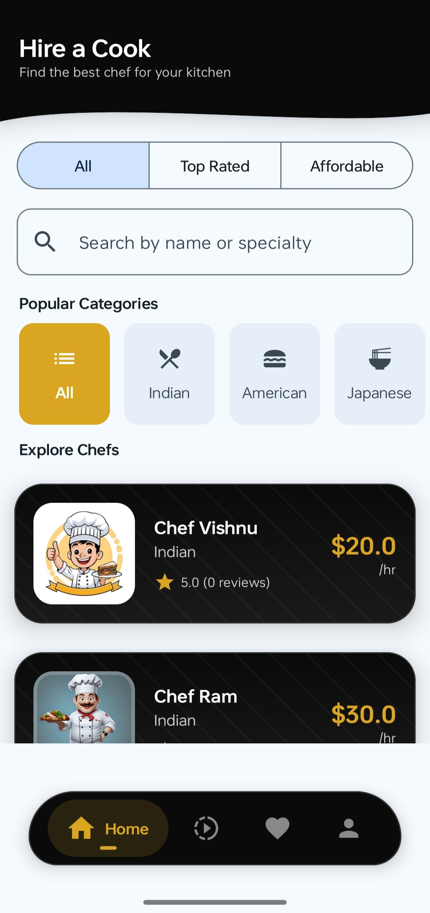
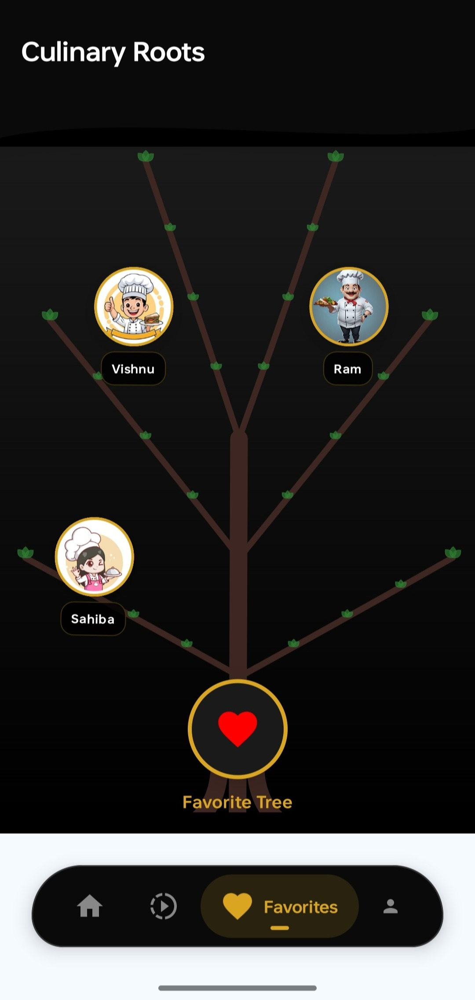
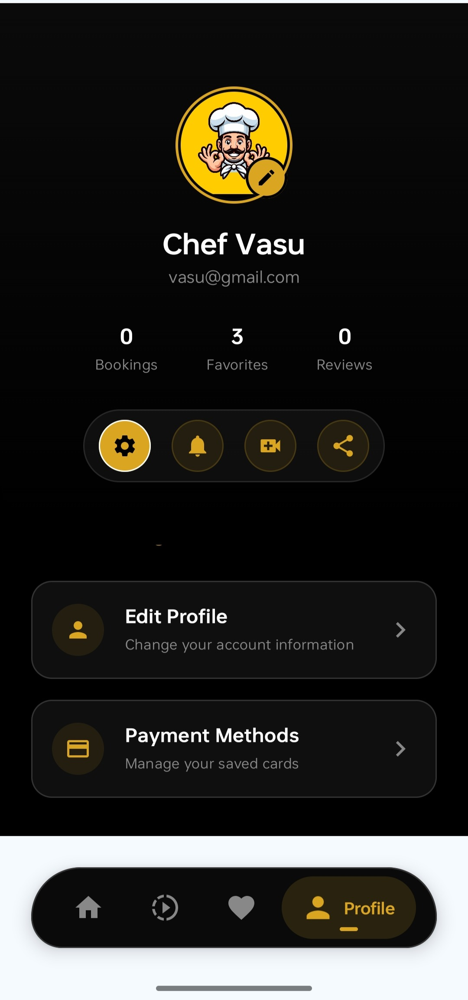

Hire a Cook App

FEATURES

Easy Onboarding : Social media login, Google sign-in, or mobile number verification (OTP).

Search & Filters : Search for cooks based on location (hyperlocal), specialty cuisine, per-hour/per-day charges, and experience levels.

Verified Cook Profiles : Access to profiles featuring, ratings, reviews.

Service Types: Options to book daily home cooks, one-time chefs for parties/events, or live-in cooks.

Real-time Tracking & Scheduling : Track the arrival time of the cook and manage booking slots.

Secure Payment Gateway : Multiple payment options including UPI, wallets, net banking, and credit/debit cards.

Review & Ratings : Option to rate cooks based on food quality, punctuality, and hygiene.

USER INTERFACE(UI)

HOME SCREEN

 

REELS SCREEN

FAVORITES SCREEN

PROFILE SCREEN

